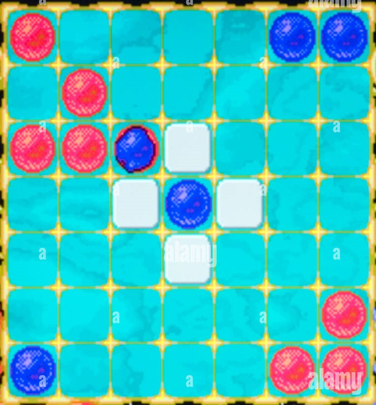

# Assegnazione Progetto

## Ataxx

- Il gioco inizia con quattro pedine posizionate (solitamente rosse e blu) agli angoli centrali di una griglia grande 7 x 7.
- I giocatori si alternano a turno. Il giocatore di colore rosso muove per primo.
- Durante il proprio turno, un giocatore può fare una di queste due azioni:
	- Muovere: Il giocatore può spostare una propria pedina in una casella adiacente se la casella è vuota. La pedina originale rimane nella sua posizione di partenza.
	- Espandere:  Il giocatore può fare una mossa che consiste nel replicare la pedina che si sta muovendo, posizionandone una nuova in una casella adiacente alla pedina di partenza. 	Questa mossa è chiamata "espansione".
- Quando una pedina viene mossa in una casella adiacente a una pedina avversaria (non necessariamente dello stesso colore), tutte le pedine della parte avversaria adiacenti a quella mossa si trasformano nel colore del giocatore che ha effettuato la mossa. Questa azione è chiamata "conquista".
- Il gioco termina quando tutte le caselle sono occupate o quando nessuno dei giocatori può effettuare una mossa. Il giocatore con il maggior numero di pedine del proprio colore sulla griglia vince la partita.