# Report
## Indice
- [1. Introduzione](#1-introduzione)
- [2. Modello di dominio](#2-modello-di-dominio)
- [3. Requisiti specifici](#3-requisiti-specifici)
    - [3.1 Requisiti funzionali](#31-requisiti-funzionali)
    - [3.2 Requisiti non funzionali](#32-requisiti-non-funzionali)
- [4. System Design](#4-system-design)
- [5. OO Design](#5-oo-design)
- [6. Riepilogo del test](#6-riepilogo-del-test)
- [7. Manuale utente](#7-manuale-utente)
- [8. Processo di sviluppo e dell'organizzazione del lavoro](#8-processo-di-sviluppo-e-dellorganizzazione-del-lavoro)
- [9. Analisi retrospettiva](#9-analisi-retrospettiva)
    - [9.1 Sprint 0](#91-sprint-0)
    - [9.2 Sprint 1](#92-sprint-1)

## 1. Introduzione
Ataxx è un gioco da tavolo strategico che ha catturato l'interesse di giocatori e programmatori fin dalla sua introduzione nel 1990. Originariamente sviluppato come videogioco arcade dalla casa produttrice The Leland Corporation, Ataxx è stato successivamente convertito per numerose piattaforme, tra cui i personal computer e le console domestiche. Il gioco si distingue per le sue regole semplici ma profonde, che richiedono un pensiero strategico avanzato per padroneggiare.

Ataxx è l'evoluzione di un precedente gioco chiamato Assimilation (o Infection), degli stessi autori, e non sembra sia mai stato distribuito come gioco da tavolo. 
Alcuni aspetti del gioco (in particolare la cattura) ricordano l'Othello.
Ataxx ha senz'altro ispirato il gioco Hexxagon (1992), che si differenzia solo per la forma del tavoliere.
Il gioco ha numerosissime varianti; esistono infatti parecchie versioni come gioco per computer, con diversi nomi e con differenze che riguardano principalmente la disposizione delle pedine all'inizio della partita o l'assetto del tavoliere (in qualche caso il tavoliere comprende caselle non accessibili, i cosiddetti "blocchi", variamente posizionate). 

L'eleganza di Ataxx risiede nella sua semplicità di regole combinata con la complessità strategica. Ogni mossa non solo influenza il proprio controllo del tabellone, ma modifica anche il possesso dei pezzi avversari, creando un dinamismo continuo che rende ogni partita unica e imprevedibile. Questo ha reso Ataxx non solo un passatempo popolare, ma anche un interessante oggetto di studio per l'intelligenza artificiale e la teoria dei giochi.

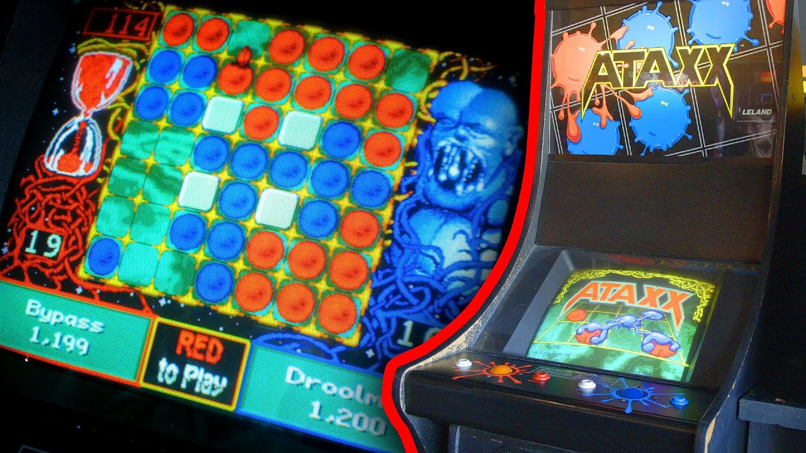

## 2. Modello di dominio
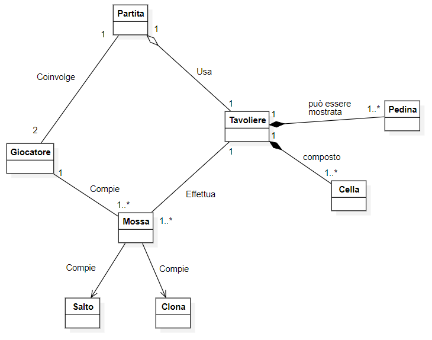

## 3. Requisiti Specifici
### 3.1 Requisiti funzionali
__RF1  -   Comando help__
       
 Come giocatore voglio visualizzare l’elenco dei comandi in modo da poter scegliere il comando da utilizzare.
 - __Stato iniziale__: Il giocatore, dopo aver avviato il gioco, si trova nella schermata iniziale e non sa che comando utilizzare.
- __Procedura__ :Il giocatore deve digitare il comando `/help`, `--help` o `-h` per visualizzare la lista dei comandi.
- __Stato finale__: Il giocatore deve essere in grado di poter accedere ai comandi con il comando /help, di poter visualizzare la lista dei comandi e di scegliere il comando senza che il sistema gli dia errore.


__RF2  -   Comando gioca__
       
Come giocatore voglio iniziare una nuova partita in modo da poter giocare.
 - __Stato iniziale__: Il giocatore si trova nel menu principale e vuole iniziare una nuova partita. 
- __Procedura__ : Per iniziare una nuova partita, il giocatore deve digitare il comando `/gioca`.
- __Stato finale__: Al giocatore viene mostrato il tavoliere di gioco con le pedine ai 4 angoli con la possibilità di effettuare la prima mossa oppure di digitare altri comandi.

__RF3  -   Comando vuoto__
       
  Come giocatore voglio mostrare il tavoliere vuoto in modo da poter visualizzare il tavoliere senza pedine.
 - __Stato iniziale__:  Il giocatore si trova nel menu principale e vorrebbe visualizzare il tavoliere di gioco vuoto.
- __Procedura__ : Per visualizzare il tabellone vuoto, il giocatore deve digitare il comando `/vuoto`.
- __Stato finale__: Al giocatore verrà mostrata una tabella 7x7 senza le pedine posizionate agli angoli. La tabella sarà numerata dall’1 al 7 per le righe, mentre per le colonne verranno utilizzate le lettere che vanno da ‘a’ a ‘g’.

__RF4  -   Comando tavoliere__
       
 Come giocatore voglio mostrare il tavoliere con le pedine in modo da poter visualizzare le pedine in formato Unicode.
 - __Stato iniziale__: Il giocatore deve avviare una nuova partita per poter visualizzare il tavoliere con le pedine in formato Unicode 
- __Procedura__ : Per poter visualizzare il tavoliere con le pedine in formato Unicode, il giocatore deve iniziare una nuova partita con il comando `/gioca`, digitare il comando ‘comandi’ e successivamente digitare il comando `/tavoliere`.
- __Stato finale__: Al giocatore viene mostrato il tavoliere indicizzato (7x7) con le pedine posizionate agli angoli in formato Unicode (⚪️ e ⚫️);


__RF5  -   Comando qualimosse__
       
  Come giocatore voglio visualizzare le mosse possibili di una pedina in modo da potermi aiutare in caso di difficoltà.

 - __Stato iniziale__:   Il giocatore ha avviato una nuova partita e ha visto la disposizione iniziale delle pedine sul tavolo di gioco. Ora vorrebbe sapere quali mosse può effettuare con le sue pedine.
- __Procedura__ : Per visualizzare le mosse possibili, il giocatore deve digitare il comando `/qualimosse` e in base al turno del giocatore verranno mostrate le mosse disponibili per poter muovere le pedine.
- __Stato finale__:  In base al turno del giocatore (nero o bianco) al giocatore vengono mostrate con un colore differente le mosse che possono essere effettuate.

__RF6  -   Spostamento della pedina__
       
  Come giocatore voglio giocare una nuova pedina in una casella adiacente a una propria pedina in modo da poterla spostare.
 - __Stato iniziale__:   Il giocatore si trova in partita e vorrebbe spostare la pedina di una casella vuota (es: a1 -> a2)
- __Procedura__ : Per spostare una pedina, il giocatore deve digitare le coordinate della casella della pedina che vuole spostare e la casella di arrivo.
- __Stato finale__: La pedina del giocatore che ha effettuato la mossa si sposterà duplicandosi (ovvero non abbandonerà il punto da dove è partita e creerà una nuova pedina nella casella di arrivo) in una casella adiacente (in senso ortogonale e diagonale), utilizzando una notazione algebrica del tipo: a1-a2, dove a1 è la casella di partenza e a2 è la casella adiacente.

__RF7  -   Salto della pedina__
       
 Come giocatore voglio spostare una propria pedina saltando una casella adiacente in modo da poterla spostare di una casella in più.

 - __Stato iniziale__:  Il giocatore si trova in partita e vorrebbe spostare la pedina in una casella vuota distante di due caselle (es: a1 -> a3)
- __Procedura__ : Per spostare una pedina, il giocatore deve digitare le coordinate della pedina che vuole spostare e la casella di arrivo.
- __Stato finale__: La pedina del giocatore che ha effettuato la mossa si sposterà di due caselle effettuando un ‘salto’ (ovvero abbandonerà il punto da dove è partita lasciando una casella vuota e creerà una nuova pedina nella casella di arrivo), utilizzando una notazione algebrica del tipo: a1- a3, dove a1 è la casella di partenza e a3 è la casella di arrivo.


__RF8  -   Cattura pedina__
       
  Come giocatore voglio catturare una pedina avversaria come effetto di una mossa in modo da poter vincere la partita
 - __Stato iniziale__:  Il giocatore si trova in partita e vorrebbe spostare la pedina in una casella vuota adiacente alla pedina dell’avversario.
- __Procedura__ : Per spostare una pedina, il giocatore deve digitare le coordinate della pedina che vuole spostare e la casella di arrivo.

- __Stato finale__: La pedina del giocatore che ha effettuato la mossa si sposterà. Se la pedina del giocatore si trova adiacente a una o più pedine dell’avversario, le pedine dell’avversario verranno ‘catturate’ cambiando di colore e diventeranno di proprietà del giocatore che ha effettuato la mossa.


__RF9  -   Comando mosse__
       
   Come giocatore voglio mostrare le mosse giocate in modo tale da visualizzare la cronologia delle mosse effettuate.
 - __Stato iniziale__:   Il giocatore si trova in partita e vorrebbe visualizzare le mosse effettuate
- __Procedura__ :  Per poter visualizzare le mosse eseguite, il giocatore che si trova in una partita deve digitare il comando ‘comandi’ e successivamente il comando `/mosse`.
- __Stato finale__: Il giocatore che selezionerà il comando `/mosse`, all’interno della partita, potrà visualizzare la cronologia delle mosse realizzate, per esempio: 1. a1-a2 (N); 2. g7-g6 (B).

__RF10  -   Impossibilità di movimento__
       
   Come giocatore voglio passare il turno per impossibilità di movimento in modo tale da passare il turno all’avversario
 - __Stato iniziale__:  Il giocatore si trova in partita e non può muoversi con nessuna pedina
- __Stato finale__: Il giocatore non può muovere nessuna pedina del proprio colore, l’app avvisa che il turno passa all’altro colore.

__RF11  -   Vincitore e punteggio__
       
  Come giocatore voglio visualizzare il fine partita con il vincitore e i punti segnati in modo tale che il giocatore possa visualizzare il vincitore e il punteggio ottenuto.
 - __Stato iniziale__: Il giocatore è in partita e non ci sono caselle vuote.
- __Procedura__ : L’app deve dichiarare il vincitore e il punteggio
- __Stato finale__:  Dopo che un giocatore ha effettuato una mossa e avviene il cambio turno se le caselle del tavoliere sono state tutte riempite, l’app dichiara il vincitore (Bianco o Nero) e riporta i punti del Bianco e Nero contando le rispettive pedine.

__RF12  -   Comando tempo__
       
  Come giocatore voglio mostrare il tempo di gioco in modo tale da poter visualizzare il tempo di gioco trascorso da inizio partita

 - __Stato iniziale__:   Il giocatore è in partita vuole visualizzare il tempo di gioco

- __Procedura__ : Per poter visualizzare il tempo di gioco, il giocatore che si trova in una partita deve digitare il comando ‘comandi’ e successivamente il comando `/tempo`.
- __Stato finale__: Al giocatore che selezionerà il comando `/tempo` all’interno della partita, l'app mostrerà il tempo trascorso dall’inizio partita nel formato ore:minuti:secondi.

__RF13  -   Comando blocca coordinata__
       
  Come giocatore voglio impostare caselle non accessibili in modo tale da bloccare le caselle del tavoliere

 - __Stato iniziale__: Il giocatore si trova nel menu principale e vuole bloccare le caselle del tavoliere.
- __Procedura__ : Per poter bloccare le caselle del tavoliere, il giocatore digita il comando `/blocca <coordinata>`  nel menu principale.
- __Stato finale__: Il giocatore che seleziona il comando `/blocca <coordinata>` nel menu principale, dove `<coordinata>` è la coordinata di una casella, la casella `<coordinata>` non è accessibile per le pedine ed è mostrata sul tavoliere con uno sfondo grigio. 
Non è possibile bloccare:
    - le caselle di partenza del gioco
    - tutte le caselle adiacenti a una casella di partenza del gioco, rendendo impossibile la mossa di espansione di una pedina a inizio gioco
    - tutte le caselle a distanza 2 da una casella di partenza del gioco, rendendo impossibile la mossa di salto di una pedina a inizio gioco
    - più di 9 caselle.

__RF14  -   Comando abbandona__
       
  Come giocatore voglio abbandonare la partita in modo tale da poter tornare nel menu principale dando la vittoria all’avversario

 - __Stato iniziale__:   Il giocatore si trova in partita e vuole abbandonarla

- __Procedura__ :  Per poter abbandonare la partita, il giocatore che vuole abbandonare che si trova in una partita deve digitare il comando ‘comandi’ e successivamente il comando `/abbandona`.
- __Stato finale__: Il giocatore che selezionerà il comando `/abbandona`, all’interno della partita, abbandonerà la partita ritornando al menu principale dando la vittoria all’avversario con numero di pedine a 0.

__RF15  -   Comando esci__
       
 Come giocatore voglio uscire dal gioco, in modo tale da uscire completamente dall’applicazione

 - __Stato iniziale__:   Il giocatore si trova nel menu principale e vuole uscire dal gioco
- __Procedura__ : Per poter uscire dal gioco, il giocatore che si trova nel menu principale deve digitare comando `/esci`.
- __Stato finale__: Il giocatore che selezionerà il comando `/esci`, all’interno del menu principale, uscirà dall’applicazione.


### 3.2 Requisiti non funzionali
- __RFN1__: il container Docker dell'app deve essere eseguito da terminali che supportano Unicode con encoding UTF-8 o UTF-16

  __Elenco terminali supportati__:  
  
   __Linux__:
    - Terminal

    __Windows__:
    - Powershell
    - Gitbash (in questo caso il Docker ha come prefisso winpty)
    
## 4. System Design

Dal codice creato, possiamo vedere che l'architettura utilizzata è l'architettura MVC (Model-View-Controller) che è un pattern di progettazione software utilizzato per separare la logica dell'applicazione in tre componenti interconnesse.

### Model (Modello)
Rappresenta i dati e la logica di business dell'applicazione.
- **Giocatore**: Gestisce le informazioni del giocatore.
- **Partita**: Gestisce la logica del gioco, le regole, e le condizioni di vittoria.
- **BloccaCella**: Gestisce le celle bloccate sul tavolo di gioco.
- **Tavolo**: Rappresenta il tavolo di gioco e gestisce le posizioni delle pedine.

### View (Vista)
Presenta i dati all'utente e gestisce l'interfaccia utente.
- **Menu**: Fornisce un'interfaccia per l'interazione con l'utente. Stampa i comandi disponibili e gestisce l'input dell'utente.
- **App**: Anche se è principalmente un controller, contiene parti che gestiscono l'input e l'output iniziale dell'applicazione (ad es. messaggio di benvenuto).

### Controller (Controllore)
Interpreta l'input dell'utente e aggiorna il modello e la vista di conseguenza.
- **App**: Gestisce il ciclo principale dell'applicazione, avvia la partita, e gestisce l'interazione iniziale con l'utente.
- **Menu**: Interpreta i comandi dell'utente e avvia le azioni appropriate nel modello.

### Commento sulle Decisioni Prese con Riferimento ai Requisiti Non Funzionali

#### Introduzione
L'architettura del progetto è basata sul modello MVC (Model-View-Controller). Questo modello è stato scelto per garantire una chiara separazione delle responsabilità tra i componenti, facilitare la manutenzione del codice e migliorare la scalabilità dell'applicazione. In questo documento, commenteremo le decisioni prese in relazione ai requisiti non funzionali definiti, in particolare il requisito RFN1.

#### Requisito RFN1
- **RFN1**: Il container Docker dell'app deve essere eseguito da terminali che supportano Unicode con encoding UTF-8 o UTF-16.

#### Decisioni e Motivazioni
1. **Compatibilità Unicode**
    - **Motivazione**: La compatibilità con Unicode è essenziale per assicurare che l'applicazione funzioni correttamente su diverse piattaforme senza problemi di visualizzazione dei caratteri, specialmente quelli non ASCII.
    - **Implementazione**: Tutti i messaggi di output dell'applicazione sono stati codificati in UTF-8. Le stringhe di input e output sono gestite in modo da preservare la corretta visualizzazione dei caratteri Unicode. Nella classe `App`, il flusso di output è configurato per utilizzare UTF-8:

    ```java
    try {
        System.setOut(new PrintStream(System.out, true, "UTF-8"));
    } catch (UnsupportedEncodingException e) {
        e.printStackTrace();
        System.err.println("Errore nella configurazione della codifica UTF-8.");
    }
    ```

2. **Supporto ai Terminali**
    - **Motivazione**: È importante che l'applicazione possa essere eseguita su vari terminali comunemente utilizzati dagli sviluppatori.
    - **Implementazione**: Sono stati testati diversi terminali su diverse piattaforme per assicurarsi che supportino correttamente l'esecuzione del container Docker con il prefisso `winpty` su Windows (per Gitbash) e senza prefisso su Linux e Windows PowerShell. Questo garantisce una compatibilità estesa e un'esperienza utente senza intoppi.

    ```bash
    # Esempio di esecuzione su Gitbash
    winpty docker run --rm -it myapp:latest
    ```

L'architettura MVC, insieme alle decisioni prese per soddisfare il requisito RFN1, garantisce che l'applicazione sia robusta, manutenibile e compatibile con vari ambienti di esecuzione. L'uso di Docker e la gestione accurata della codifica Unicode sono fondamentali per raggiungere questi obiettivi.

**Nota:** A causa delle specifiche del nostro progetto attuale, non possiamo utilizzare il diagramma dei package e il diagramma dei componenti. Questa decisione è stata presa perché il nostro sviluppo non prevede l'uso di pacchetti aggiuntivi né l'implementazione di interfacce.

## 5. OO Design
  ### **Diagramma delle classi**
  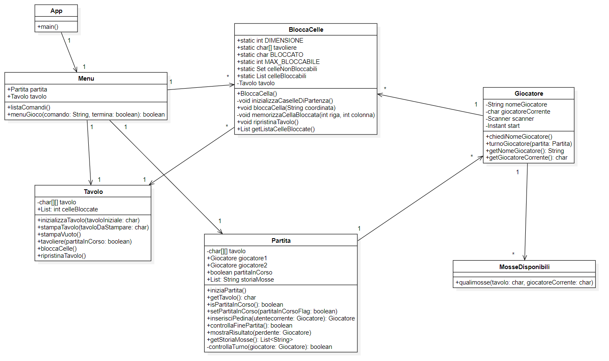
  ### **Diagramma di sequenza gioca**
  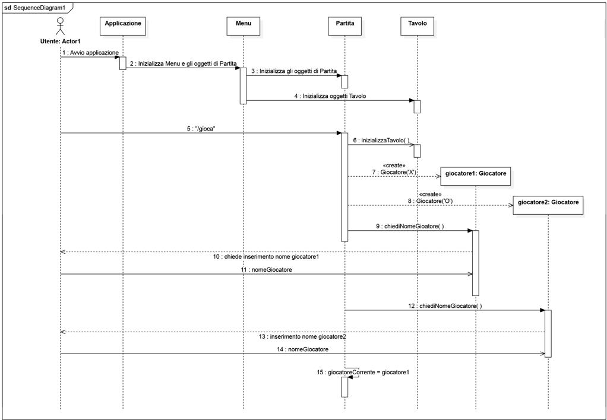
  ### **Diagramma della classe gioca**
  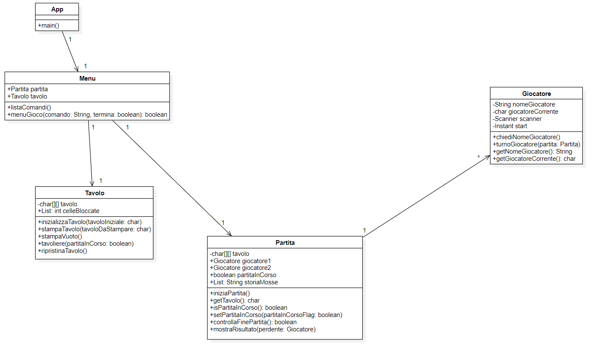
  ### **Diagramma di sequenza qualimosse**
  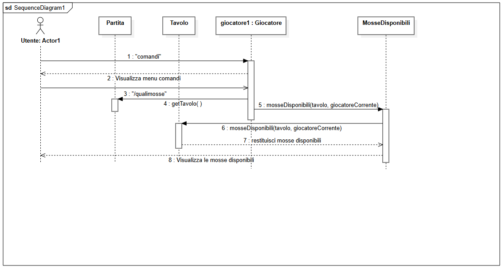
  ### **Diagramma della classe qualimosse**
  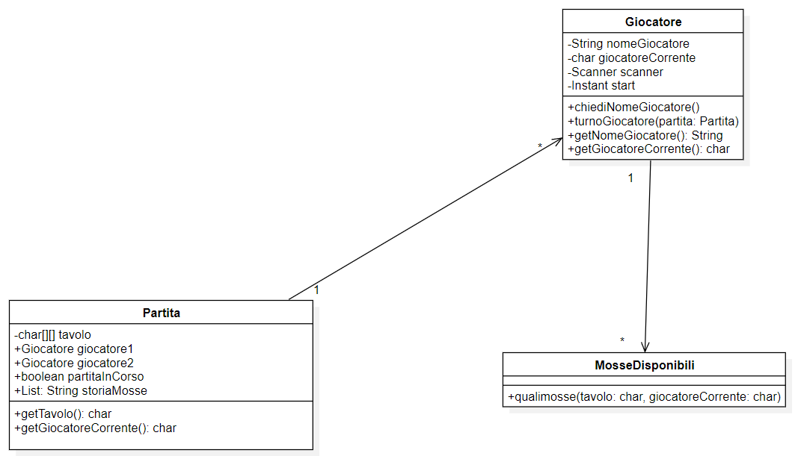
  ### **Diagramma di sequenza mossa**
  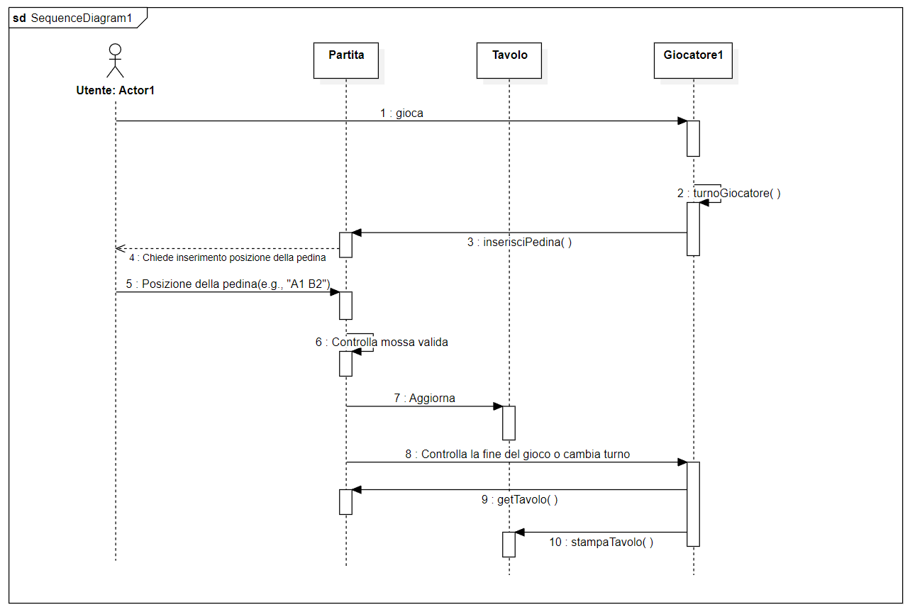
  ### **Diagramma della classe mossa**
  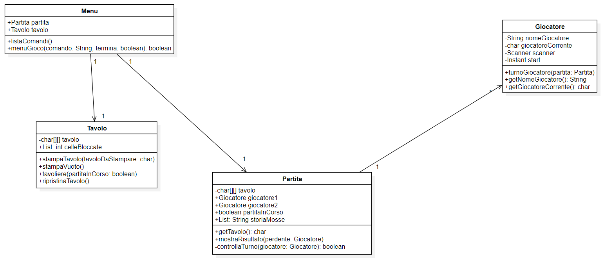
  ### **Diagramma di sequenza blocca**
  
  ### **Diagramma della classe blocca**
  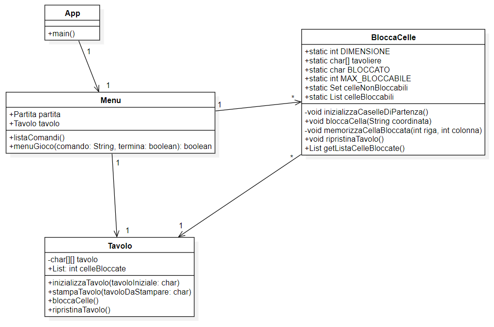

  ## Principi di OO Design

### **Information Hiding**
- **Descrizione:** Ogni componente deve custodire dei segreti al proprio interno. Se una decisione che determina il segreto cambia, solo il componente interessato sarà modificato.
- **Utilizzo:** Utilizzata all’interno della classe `App`. I dettagli dell'avvio del gioco e del ciclo di esecuzione sono nascosti all'interno della classe. Utilizzata anche nella classe `BloccaCelle` per la gestione interna delle celle bloccate, esponendo solo i metodi per bloccare e sbloccare le celle.

- **Esempio di codice:**
```java
public class App { 
    private final Scanner scanner;
    private final Menu menu;
}

public class BloccaCelle {
    public void bloccaCella(final String coordinata) {
        // Dettagli di implementazione nascosti
    }
}
```

### **Alta Coesione**
- **Descrizione:** Misura il grado di dipendenza tra elementi di uno stesso componente (sottosistema o classe). L’obiettivo è assegnare le responsabilità in modo da ottenere componenti con responsabilità ben definite.
- **Utilizzo:** La classe `Menu` gestisce esclusivamente l'interazione con l'utente e la gestione dei comandi, senza contenere logica di gioco, che è delegata ad altre classi. La classe `Partita` gestisce la logica del gioco, il ciclo di gioco e verifica le condizioni di fine partita.
- **Esempio di codice:**
```java
public class Menu {
    private final Partita partita;
    private final Tavolo tavolo;
    private final BloccaCella blocca;
}

public class Partita {
    // Responsabilità ben definita per la gestione della partita
}
```

### **Basso Accoppiamento**
- **Descrizione:** Misura il grado di dipendenza tra componenti diversi (tra sottosistemi o tra classi). L’obiettivo è assegnare le responsabilità ai componenti in modo tale da limitare l’impatto dei cambiamenti.
- **Utilizzo:** La classe `App` crea e utilizza oggetti `Menu`, ma non conosce i dettagli interni delle loro implementazioni, riducendo l'accoppiamento.
- **Esempio di codice:**
```java
public class App {
    private final Menu menu;
}
```

### **Presentazione Separata**
- **Descrizione:** La parte di codice relativa alla presentazione deve essere tenuta separata dal resto dell’applicazione.
- **Utilizzo:** La classe `Menu` gestisce l'interazione con l'utente e visualizza i comandi, mentre la classe `Partita` gestisce la logica del gioco.
- **Esempio di codice:**
```java
public void listaComandi() {
    // Visualizzazione dei comandi disponibili
}
```

### **Do Not Repeat Yourself (DRY)**
- **Descrizione:** Ogni parte significativa di una funzionalità dovrebbe essere implementata in un unico posto nel codice sorgente.
- **Utilizzo:** La gestione delle celle bloccate è centralizzata nella classe `BloccaCella`, evitando duplicazioni in altre parti del codice.
- **Esempio di codice:**
```java
public class BloccaCella {
    // Funzionalità di gestione delle celle bloccate
}
```

## Principi SOLID

### **Single Responsibility Principle (SRP)**
- **Descrizione:** Ogni classe ha una responsabilità ben definita.
- **Utilizzo:** La classe `Giocatore` gestisce solo le informazioni e le azioni del giocatore.
- **Esempio di codice:**
```java
public class Giocatore {
    private String nomeGiocatore;
}
```

### **Open/Closed Principle (OCP)**
- **Descrizione:** Le entità della programmazione devono essere aperte alle estensioni e chiuse alla modifica.
- **Utilizzo:** È possibile aggiungere nuovi tipi di gioco o nuove regole senza modificare le classi esistenti.

### **Liskov Substitution Principle (LSP)**
- **Descrizione:** Le sottoclassi devono poter essere utilizzate al posto della loro classe padre.
- **Utilizzo:** Questo principio è facilitato dal design attuale, dove le operazioni sono ben definite e auto-consistenti.

## **Design Pattern Utilizzati**

Nel codice fornito vengono utilizzati diversi design pattern per migliorare la modularità, la manutenzione e l'estensibilità del sistema. 

### **Structural Pattern**

### Facade
- **Descrizione**: Fornisce un’interfaccia unificata di più alto livello rispetto alle interfacce del sottosistema.

- **Utilizzo**: La classe `Menu` fornisce un'interfaccia semplificata per interagire con vari componenti del gioco.

- **Codice**:
```java
public class Menu {
    private final Partita partita;
    private final Tavolo tavolo;
    private final BloccaCella blocca;

    public Menu() {
        this.partita = new Partita();
        this.tavolo = new Tavolo();
        this.blocca = new BloccaCella();
    }
}
```

### Decorator
- **Descrizione**: Definisce oggetti Decorator che estendono le funzionalità di un oggetto a run-time.

- **Utilizzo**: Aggiunge dinamicamente ulteriori responsabilità alle celle (blocco/sblocco).

- **Codice**:
```java
public class BloccaCella {
    private static final char BLOCCATO = '#';
    private static final int MAX_BLOCCABILE = 9;
    private final Tavolo tavolo;
    private static List<int[]> celleBloccate = new ArrayList<>();
    ...
    public void bloccaCella(final String coordinata) {
        ...
    }
}
```

## Behavioral Patterns

### Command Pattern
- **Descrizione**: Incapsula la richiesta in un oggetto che accoda, registra le richieste e supporta l'undo.

- **Utilizzo**: La classe `Menu` gestisce i vari comandi dell'utente tramite un metodo `menuGioco`.

- **Codice**:
```java
public boolean menuGioco(final String comando, final boolean termina) {
    switch (cmd) {
        case "/help":
        case "--help":
        case "-h":
            listaComandi();
            break;
        case "/gioca":
            partita.iniziaPartita();
            break;
        case "/blocca":
            if (parts.length > 1) {
                String coordinata = parts[1];
                blocca.bloccaCella(coordinata);
            } else {
                System.out.println("Errore: coordinata non specificata. Utilizzo corretto: /blocca <coordinata>");
            }
            break;
        ...
    }
    return nuovoTermina;
}
```

### Observer
- **Descrizione**: Definisce un meccanismo di publish-subscribe in modo tale che quando un oggetto cambia stato, tutti gli oggetti che dipendono da esso sono notificati e aggiornati automaticamente.

- **Utilizzo**: Monitora lo stato del gioco e aggiorna i componenti di conseguenza.

- **Codice**:
```java
public class Partita {
    private char[][] tavolo;
    private Giocatore giocatore1;
    private Giocatore giocatore2;
    private boolean partitaInCorso;
    private List<String> storiaMosse;

    public void iniziaPartita() {
        ...
        while (partitaInCorso) {
            if (controllaTurno(giocatoreCorrente)) {
                giocatoreCorrente.turnoGiocatore(this);
            } else {
                System.out.println("Nessuna mossa disponibile per " + giocatoreCorrente.getNomeGiocatore());
            }
            giocatoreCorrente = (giocatoreCorrente == giocatore1) ? giocatore2 : giocatore1;
        }
    }
}
```

### State
- **Descrizione**: Incapsula il comportamento che dipende dallo stato in un oggetto separato.

- **Utilizzo**: Cambia il comportamento in base allo stato del giocatore durante il gioco.

- **Codice**:
```java
public class Giocatore {
    private String nomeGiocatore;
    private char giocatoreCorrente;
    private Scanner scanner;
    private Instant start;
    private static final BloccaCella BLOCCA_CELLA = new BloccaCella();
    ...
    public void turnoGiocatore(final Partita partita) {
        Tavolo tavolo = new Tavolo();
        Giocatore giocatoreCorrenteTurno = this;
        ...
        while (turnoInCorso) {
            ...
            switch (domanda) {
                case "gioca":
                    giocatoreCorrenteTurno = partita.inserisciPedina(giocatoreCorrenteTurno);
                    if (partita.controllaFinePartita() || !partita.isPartitaInCorso()) {
                        System.out.println("La partita è finita.");
                        tavolo.stampaTavolo(partita.getTavolo());
                        Giocatore giocatorePerdente = partita.controllaPedinePerse();
                        partita.mostraRisultato(giocatorePerdente);
                        partita.setPartitaInCorso(false);
                    }
                    turnoInCorso = false;
                    break;
                ...
            }
        }
    }
}
```


## 6. Riepilogo del test
### Resoconto dei Test Eseguiti

Sono stati eseguiti circa 21 test nelle seguenti classi:
 
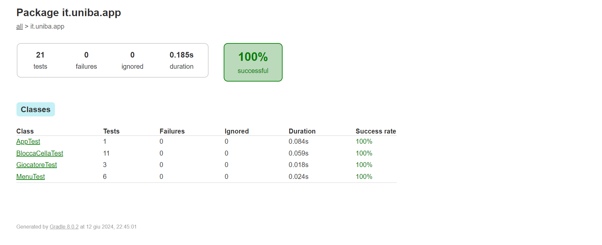

#### BloccaCellaTest

In questa classe, i test si concentrano sul bloccaggio di specifiche celle. Le verifiche includono:

- Celle adiacenti alla casella di partenza.
- Celle a distanza di due.
- Celle inesistenti quali:
  - Celle con coordinate fatte di caratteri casuali (es. XX, XYZ).
  - Celle con coordinate composte da riga e colonna ben superiori alla portata del tavolo (es. K7, M2).

I test su questa classe raggiungono una copertura dell'87%, dimostrando la robustezza dell'applicativo.

#### GiocatoreTest

In questa classe, ci siamo concentrati su:

- Chiedere il nome del giocatore per dimostrare il passaggio di informazioni tra le classi test.
- La gestione di input non validi, assicurando che l'utente non possa inviare comandi non consentiti.
- Dimostrare che, se uno dei due giocatori vuole abbandonare la partita, deve inserire il comando corretto.

I test in questa classe raggiungono una copertura del 40%, comprendendo informazioni essenziali per rendere l'applicativo sicuro.

#### MenuTest

In questa classe, i test e i meccanismi sono molto simili a quelli di `BloccaCellaTest`. Le verifiche includono:

- Controllo sulle caselle adiacenti alla casella di partenza: verifica che il comando `/blocca A2` restituisca un messaggio di errore specifico se si tenta di bloccare una cella adiacente a una casella di partenza.
- Controllo delle coordinate di partenza: verifica che il comando `/blocca A1` restituisca un messaggio di errore specifico se si tenta di bloccare una casella di partenza.
- Bloccaggio di posizioni con coordinate valide: verifica che il comando `/blocca A4` restituisca un messaggio di successo quando si blocca una cella valida.
- Verifica che il comando `/tavoliere` restituisca un messaggio di errore se non è stata trovata nessuna partita in corso.
- Verifica che il comando `/qualimosse` restituisca un messaggio di errore se non è stata trovata nessuna partita in corso.
- Verifica che il comando `/abbandona` restituisca un messaggio di errore se non è stata trovata nessuna partita in corso.

La copertura in questo test è stata del 32%, un numero che, nonostante sia basso, è molto qualitativo.

### Copertura Totale

La copertura totale è stata del 24%, una percentuale piuttosto bassa a causa di test che purtroppo non si sono concretizzati al meglio, lasciando alcune parti del progetto scoperte. Il team ha assimilato gli errori commessi e si impegnerà a evitarli in futuro.
  
## 7. Manuale Utente
- __*`/help`*__ (selezionabile nel menu iniziale del gioco):
	Il sistema permette di visualizzare tutti i comandi disponibili all’utente;

    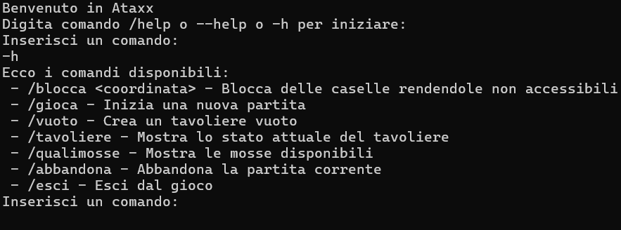

- __*`/gioca`*__ (selezionabile nel menu iniziale del gioco):
Permette di iniziare una nuova partita, chiede l’inserimento del nickname dei due giocatore e successivamente chiede se l’utente del turno corrente vuole giocare o utilizzare dei comandi. Se l’utente seleziona l’opzione comandi, allora verranno visualizzati a schermo i comandi utilizzabili, ovvero:
    -	*`/tavoliere`*;
    -	*`/qualimosse`*;
    -   *`/mosse`*;
    -   *`/tempo`*;
    -	*`/abbandona`*.

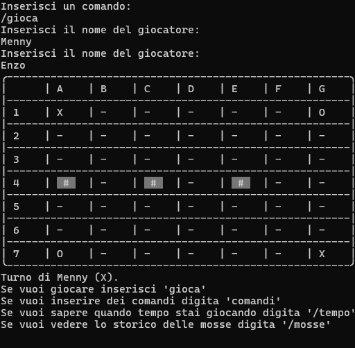

Se l’utente seleziona l’opzione gioca, gli verranno chieste: 
- le coordinate della pedina che vuole utilizzare (giocatore1 a1, g7, giocatore2 g1, a7);
- le coordinate di arrivo della pedina selezionata in precedenza. Se la casella di arrivo è adiacente alla casella di partenza, la pedina verrà duplicata. Mentre se la posizione di arrivo è distante due caselle, la mossa selezionata sarà quella del "salto", ovvero la pedina viene spostata abbandonando il punto di partenza.
    
**Esempio notazione algebrica:** `a1 a3`, dove a1 è la casella di partenza e a3 è la casella di arrivo.
    
__Nota__: La casella di arrivo deve essere libera per poter effettuare una qualsiasi mossa.

Dopo aver effettuato una mossa, se vi sono pedine avversarie adiacenti alla casella di arrivo, queste vengono catturate cambiando colore. 


    
Se il giocatore non può muovere nessuna pedina del proprio colore, l’app avvisa che il turno passa all’altro colore.

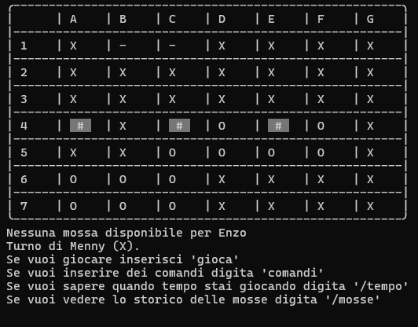

Se nessuna pedina può essere mossa perché le caselle del tavoliere sono state tutte riempite, allora l’app dichiara il vincitore (Bianco o Nero) e riporta i punti del Bianco e Nero contando le rispettive pedine.

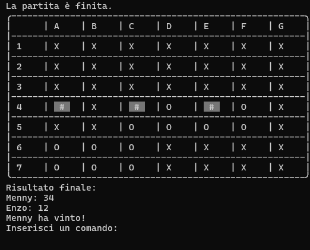

- __*`/vuoto`*__ (selezionabile nel menu iniziale del gioco):
    Permette di visualizzare il tavoliere vuoto, senza pedine posizionate;
    
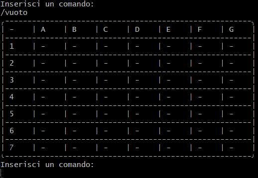
    

- __*`/tavoliere`*__ (selezionabile in /gioca nella voce “comandi”):
	Permette di visualizzare il tavoliere con le pedine in formato unicode (⚪️ e      ⚫️);

  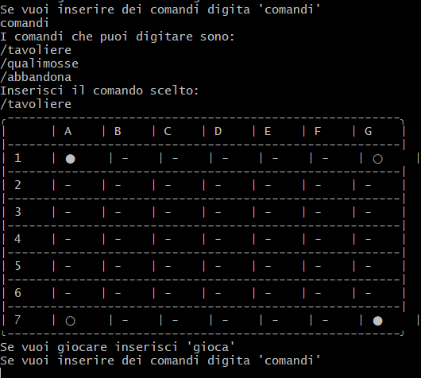

- __*`/qualimosse`*__ (selezionabile in /gioca nella voce “comandi”):
Permette di visualizzare le mosse disponibili all’utente che digita tale comando (utente delle pedine bianche o utente delle pedine nere). Le mosse disponibili sono:

    a) in giallo le caselle raggiungibili con mosse che generano una nuova pedina;

    b) in arancione raggiungibili con mosse che consentono un salto;

    c) in rosa le caselle raggiungibili con mosse di tipo a) o b).

    Le mosse verranno visualizzate sotto forma di un tavoliere che avrà le pedine posizionate di tutti e due i giocatori, però attorno alle pedine del giocatore che ha utilizzato il comando verranno visualizzati i colori elencati in precedenza (sottoforma di lettere colorate);

    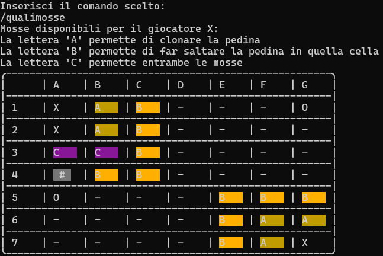

- __*`/mosse`*__ (sezionabile in /gioca nella voce “comandi”): L'app mostra la storia delle mosse con notazione algebrica, per esempio: 1. a1-a2 (N); 2. g7-g6 (B);

  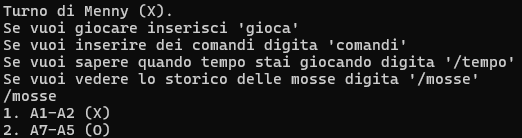
    

- __*`/tempo`*__ (sezionabile in /gioca nella voce “comandi”): L'app mostra il tempo trascorso dall’inizio partita nel formato ore:minuti:secondi;

  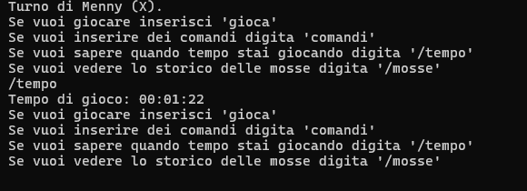
  
- __*`/blocca <coordinata>`*__ (selezionabile nel menu iniziale del gioco): dove `<coordinata>` sono le coordinate di una casella, la casella `<coordinata>` non è accessibile per le pedine ed è mostrata sul tavoliere con uno cancelletto `#` con uno sfondo grigio.

    __Nota__:  Non è possibile bloccare:
    - le caselle di partenza del gioco;
    - tutte le caselle adiacenti a una casella di partenza del gioco, rendendo impossibile la mossa di espansione di una pedina a inizio gioco;
    - tutte le caselle a distanza 2 da una casella di partenza del gioco, rendendo impossibile la mossa di salto di una pedina a inizio gioco;
    - più di 9 caselle.

    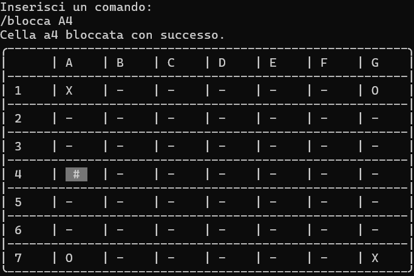

- __*`/abbandona`*__ (sezionabile in /gioca nella voce “comandi”):
Permette all’utente di abbandonare la partita in corso, permettendo all’avversario di vincere a tavolino;

  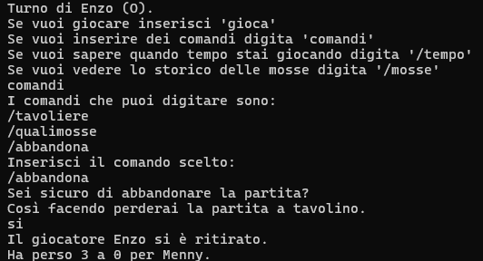
    

- __*`/esci`*__ (selezionabile nel menu iniziale del gioco):
	Permette di uscire dall’applicazione/gioco.

  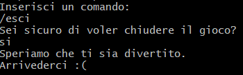

## 8. Processo di sviluppo e dell'organizzazione del lavoro


### **Pianificazione**

Per la creazione del gioco “Ataxx” in Java, è stato formato un gruppo di 4 persone, ciascuna munita di un PC accessoriato con tutti i programmi necessari per la realizzazione del gioco. Il gioco è composto da un menu di avvio, varie opzioni per l'utente durante il gioco e la logica di gioco completa. Il progetto è stato suddiviso in 3 Sprint:

- **Sprint 0:** Dimostrare familiarità con Git, GitHub flow e il processo agile;
  - Data inizio: 31 marzo;
  - Data fine: 12 aprile.
- **Sprint 1:** Impostare il programma per ricevere i primi comandi;
  - Data inizio: 6 maggio;
  - Data fine: 21 maggio;
- **Sprint 2:** Completare il gioco assicurando la qualità del software;
  - Data inizio: 29 maggio;
  - Data fine: 12 giugno.

### **Organizzazione**

Il team, guidato dal capo-gruppo Antonio Mennea e composto da Vincenzo Sarcina, Mattia Stella e Ruggiero Sabino, ha lavorato intensamente sulla parte di codice e sulla stesura del report. I metodi di comunicazione utilizzati dal team sono stati:

- **Discord:** Utilizzato per chiamate vocali o video giornaliere, permettendo al team di aggiornarsi sul progresso del lavoro e di coordinarsi in tempo reale sullo sviluppo del codice e del report.
- **WhatsApp:** Utilizzato per avvisi testuali. Quando non era possibile collegarsi in chiamata vocale, il team ha comunicato tramite messaggi testuali per segnalare problemi o confermare il completamento degli obiettivi stabiliti.
- **Incontri in presenza:** Organizzati in caso di incomprensioni o quando necessario, il team si è riunito di persona per discutere eventuali problemi, avvisi sul completamento degli obiettivi e per collaborare durante le fasi di scrittura del progetto.

### **Esecuzione**

Il team ha seguito attentamente le direttive degli Sprint dettate dal Product Owner, migliorando la qualità del software grazie al Product Backlog fornito. Ogni membro del team ha verificato il lavoro svolto, correggendo eventuali errori e supportandosi reciprocamente nelle diverse fasi del progetto. La coordinazione è stata fondamentale per il completamento dei compiti assegnati. Inoltre, tutti i membri del team hanno seguito e assimilato diligentemente le informazioni fornite dal Product Owner.

Tutti i comandi delle issues sono stati seguiti con precisione, aggiungendo ogni richiesta in modo accurato. Il lavoro è stato suddiviso tra i membri del team, i quali, al completamento di ogni comando o in caso di problemi, condividevano e spiegavano il loro operato ai compagni. Questo ha garantito che tutti fossero sempre aggiornati su quanto fatto e ha permesso di correggere eventuali errori o malfunzionamenti.

Per la verifica, sono stati effettuati diversi test del gioco, provando ogni tipo di variabile di input. Inoltre, il gioco è stato testato da volontari per ottenere feedback sulla comprensione dei comandi e sul design del gioco.

### **Strumenti Utilizzati**

Il team di sviluppo ha impiegato una varietà di strumenti per garantire un processo di sviluppo del gioco efficiente e organizzato:

1. **Ambienti di Sviluppo (IDE)**
   - NetBeans e Visual Studio: Utilizzati esclusivamente per la scrittura del codice in Java. NetBeans e Visual Studio hanno offerto potenti funzionalità di debugging e gestione dei progetti, facilitando il lavoro degli sviluppatori.
2. **Strumenti per la Documentazione**
   - Microsoft Word e Google Docs: Utilizzati per la stesura della documentazione e per prendere appunti durante le varie fasi del progetto. Word ha fornito capacità avanzate di formattazione, mentre Google Docs ha facilitato la collaborazione in tempo reale, consentendo modifiche simultanee e commenti.
   - Visual Studio: Oltre alla scrittura del codice, Visual Studio è stato utilizzato per creare documenti in formato Markdown, mantenendo una documentazione leggibile e ben strutturata.
3. **Modellazione del Dominio**
   - StarUML: Utilizzato per creare il modello di dominio, i diagrammi di sequenza e il diagramma delle classi del gioco. StarUML ha permesso al team di visualizzare e progettare le classi, le relazioni e le interazioni tra gli oggetti del sistema.
4. **Gestione del Versionamento e delle Issues**
   - GitHub e Git Bash: Utilizzati per il controllo di versione e la gestione delle issues. GitHub ha permesso di gestire il codice sorgente, tenere traccia delle modifiche e facilitare la collaborazione tra i membri del team. Git Bash è stato utilizzato per eseguire comandi Git e interagire con i repository remoti.

### **Obiettivi del Progetto**

1. Sviluppare un gioco funzionale e divertente che includesse tutte le funzionalità di base e avanzate previste dal design iniziale.
2. Assicurare la qualità del software attraverso test rigorosi e un continuo miglioramento basato sul feedback degli utenti.
3. Utilizzare metodologie agili per gestire il progetto, garantendo una buona comunicazione e collaborazione all'interno del team.

### **Ruoli dei Membri del Team**

**Antonio Mennea (Capo-gruppo):** Ha guidato il team, coordinando le attività e assicurando che ogni membro rispettasse le scadenze. Ha gestito le riunioni e ha mantenuto la comunicazione con il Product Owner.

**Vincenzo Sarcina - Mattia Stella - Ruggiero Sabino (Membri):** Con l'aiuto del capogruppo Antonio Mennea, hanno collaborato sullo sviluppo del codice, nella fase dei debugging e dei test e nella stesura del file Report.md.

### **Competenze Richieste**

1. Programmazione in Java: Tutti i membri del team dovevano avere una buona conoscenza del linguaggio Java per sviluppare il gioco.
2. Gestione di Progetti Agili: Familiarità con le metodologie agili, come Scrum, per gestire il progetto in sprint e utilizzare strumenti come GitHub per il versionamento e la gestione delle issues.
3. Testing e Debugging: Capacità di eseguire test approfonditi e debug del codice per garantire un prodotto di alta qualità.
4. Comunicazione e Collaborazione: Abilità di comunicare efficacemente e collaborare con il team per risolvere problemi e prendere decisioni.

## **Descrizione degli Sprint**

### Sprint 0: Familiarità con Git, GitHub Flow e il Processo Agile

- **Data inizio:** 31 marzo
- **Data fine:** 12 aprile

Durante lo Sprint 0, il team ha concentrato gli sforzi sulla configurazione iniziale del progetto e sulla familiarizzazione con gli strumenti e le metodologie agili. Le attività principali hanno incluso:

- Aggiornamento del README per riflettere l'anno corrente.
- Modifica dell'assegnazione del progetto per descrivere i requisiti e gli obiettivi specifici dell'anno.
- Aggiornamento della Guida per lo studente, includendo PMD come strumento di quality assurance.
- Creazione del file CODE_OF_CONDUCT e del file ISPIRATORE nella directory docs.
- Aggiunta di un badge GitHub Actions al README per indicare lo stato del build del progetto.

L'obiettivo di questo sprint era migliorare la documentazione e la gestione del progetto, creando una base solida per il lavoro futuro.

### Sprint 1: Impostazione del Programma per Ricevere i Primi Comandi

- **Data inizio:** 6 maggio
- **Data fine:** 21 maggio

Lo Sprint 1 ha visto l'implementazione delle prime funzionalità del gioco "Ataxx". Le attività principali includevano:

- Aggiunta del comando /help, insieme ai flag /--help e /h, per mostrare la lista dei comandi disponibili.
- Implementazione dei comandi principali:
  - /gioca: Inizia una nuova partita.
  - /vuoto: Mostra un tavoliere vuoto di 49 caselle quadrate.
  - /esci: Permette di chiudere il gioco.
- Interazione di gioco con il comando /gioca, permettendo di fare la prima mossa.
- Comandi aggiuntivi come /tavoliere, /qualimosse, e /abbandona.
- Correzione di errori di stile e bug segnalati da CheckStyle e SpotBugs.

L'obiettivo era impostare le basi del gioco, implementando le prime funzionalità e migliorando la qualità del codice.

### Sprint 2: Completamento del Gioco e Assicurazione della Qualità del Software

- **Data inizio:** 29 maggio
- **Data fine:** 12 giugno

Lo Sprint 2 si è concentrato sul completamento del gioco e sull'assicurazione della qualità del software. Le attività principali includevano:

- Completamento delle funzionalità di gioco, inclusa la logica avanzata e aggiunta di altre opzioni per l'utente:
 
  - Comando `/mosse`: mostra la storia delle mosse con notazione algebrica (Esempio: a1-a2 (N); 2. g7-g6 (B)).
  - Comando `/tempo`: mostra il tempo trascorso dall’inizio partita nel formato ore:minuti:secondi.
  - Comando `/blocca <coordinata>`: permette di inserire una coordinata, dove la coordinata si riferisce ad una cella del tavoliere che diventerà inaccessibile mostrando un cancelletto `#` con sfondo grigio.
- Test approfonditi per identificare e correggere eventuali bug.
- Raccolta e analisi del feedback dai tester volontari e implementazione delle modifiche necessarie.
- Preparazione e revisione finale della documentazione del progetto.


L'obiettivo di questo sprint era garantire un prodotto finale di alta qualità, completo e privo di bug, pronto per il rilascio.

## Conclusioni per Ciascun Sprint

### **Conclusioni Sprint 0**

Lo Sprint 0 ha migliorato la documentazione e la gestione del progetto, stabilendo una solida base per il lavoro futuro. La familiarità con Git e GitHub Flow ha preparato il team a gestire efficacemente il codice e le versioni del progetto.

### **Conclusioni Sprint 1**

Lo Sprint 1 ha visto l'implementazione di funzionalità chiave del gioco, impostando le basi per lo sviluppo futuro. La correzione degli errori di stile e dei bug ha migliorato la qualità del codice, mentre l'implementazione dei comandi ha reso il gioco funzionale e interattivo.

### **Conclusioni Sprint 2**

Lo Sprint 2 ha assicurato che tutte le funzionalità del gioco fossero complete e funzionanti. L'ottimizzazione del codice e i test approfonditi hanno garantito un prodotto finale di alta qualità. Il feedback dei tester ha contribuito a migliorare l'esperienza utente, rendendo il gioco più fluido e piacevole.

## Conclusioni

### **Sintesi e Risultati Ottenuti**

Il processo di sviluppo del gioco "Ataxx" è stato caratterizzato da una stretta collaborazione tra i membri del team, un'efficace comunicazione e l'utilizzo di metodologie agili. Attraverso la suddivisione del lavoro in sprint, il team è riuscito a gestire il progetto in modo strutturato e a rispettare le scadenze stabilite.

Le principali sfide affrontate durante il progetto includevano la gestione delle diverse parti del codice e l'integrazione delle componenti sviluppate individualmente. Tuttavia, grazie all'uso di strumenti come GitHub per il controllo delle versioni e la gestione delle issues, il team è riuscito a superare queste difficoltà, garantendo un prodotto finale di alta qualità.

Il feedback raccolto dai tester ha giocato un ruolo cruciale nel miglioramento del gioco. Le modifiche implementate in base al feedback hanno contribuito a creare un'esperienza utente più fluida e piacevole. La documentazione accurata e il testing rigoroso hanno assicurato che il gioco fosse privo di bug e pronto per il rilascio.

In conclusione, il progetto "Ataxx" è stato un esempio di come una buona pianificazione, una chiara suddivisione dei ruoli e una comunicazione efficace possano portare al successo di un progetto di sviluppo software. Il team ha dimostrato capacità di adattamento e problem-solving, completando il progetto nei tempi previsti e con risultati eccellenti.

## 9. Analisi Retrospettiva 
### 9.1 Sprint 0

Lo Sprint 0 aveva come obiettivo iniziare a manipolare i file, dimostrando di aver compreso come utilizzare GitHub.
Per iniziare è stato aggiornato il titolo del README per riflettere l'anno corrente, inoltre, è stata modificata l'assegnazione del progetto per descrivere i requisiti e gli obiettivi specifici di quest'anno. 
La Guida per lo studente è stata aggiornata per includere PMD come strumento di quality assurance e le figure nella Guida per lo studente sono state personalizzate per riflettere il repository, username e immagine di profilo dei membri del gruppo.
E’ stato creato un file CODE_OF_CONDUCT nella directory docs che delinea le norme di comportamento del gruppo, successivamente è stato creato il file ISPIRATORE nella directory docs, contenente una biografia dettagliata e i principali contributi del personaggio ispiratore (RICHARD "DICK" MANNING KARP). 
Per concludere è stato aggiunto un badge di GitHub Actions al README, indicando lo stato del build del progetto. 


### Conclusioni
Il compito ha comportato una serie di modifiche mirate a migliorare la documentazione e la gestione del progetto. Ogni attività svolta ha contribuito a rendere il progetto più organizzato, accessibile e orientato alla qualità, migliorando sia l'esperienza degli studenti che l'efficacia del progetto nel suo complesso.


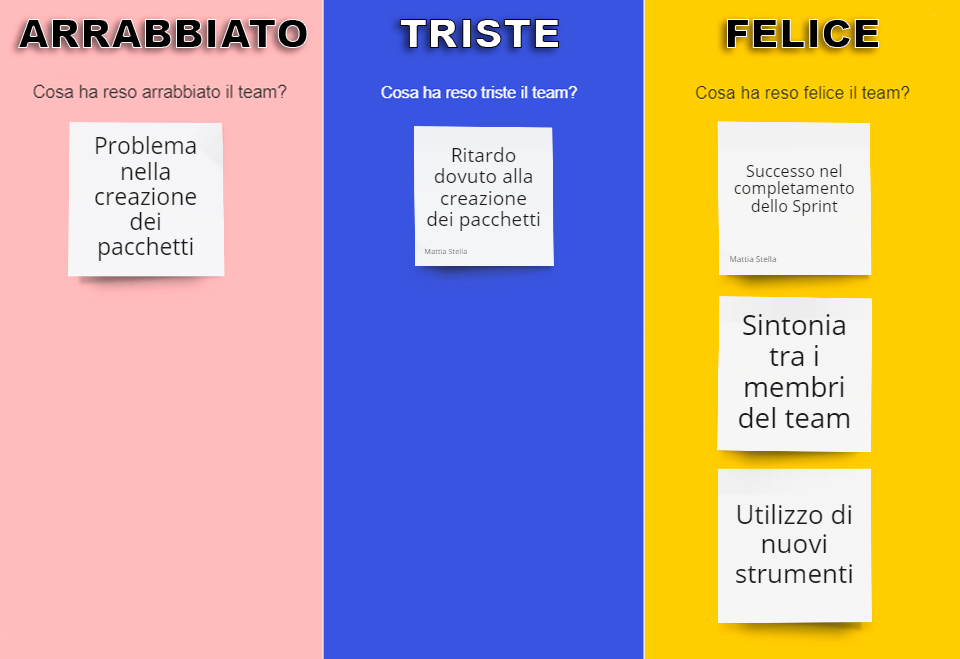

### 9.2 Sprint 1 

Lo Sprint 1 aveva come obiettivo l’impostazione del programma nel ricevere i primi comandi.
Come prima cosa è stato aggiunto il comando *`/help`* (o usando i flag *`/-- help`* o *`/h`*) che, invocandolo, mostra la lista dei comandi disponibili:
-   *`/gioca`* : Mostra, se nessuna partita è in corso, inizia una partita.
-   *`/vuoto`* : Mostra un tavoliere vuoto di 49 caselle quadrate (7x7) con righe numerate da 1 a 7 e colonne da ‘a’ a ‘g’;
-   *`/esci`* : Permette di chiudere il gioco;
Selezionando il comando *`/gioca`*, il programma stampa a schermo la tavola con le 4 pedine agli angoli e permette di utilizzare il comando *`gioca`* per effettuare una mosse con la dicitura:
-   _esempio_ *`a1`* (posizione iniziale) *`- a2`* (posizione di arrivo).
Questo però è possibile solo dal giocatore con le pedine nere (il codice non è stato completato).
Oltre al comando *`Gioca`*, il programma permette di digitare il comando *`Comandi`* per utilizzare i comandi in partita come:
-   *`/tavoliere`* : Mostra la posizione di tutte le pedine sul tavoliere utilizzando il formato Unicode.
-   *`/qualimosse`* : Mostra le mosse disponibili per il giocatore di turno, evidenziando in giallo le caselle raggiungibili con mosse che generano una nuova pedina, in arancione quelle che consentono un salto, e in rosa le caselle raggiungibili con entrambe le tipologie di mosse.
-   *`/abbandona`* : Permette di uscire dalla partita.
In questo Sprint sono stati inoltre identificati e corretti diversi errori di stile e bug segnalati da CheckStyle e SpotBugs. Questo miglioramento incrementa la qualità e la manutenibilità del codice, riducendo la possibilità di errori futuri.


### Conclusione

Il compito assegnato è stato svolto in modo completo, coprendo tutte le funzionalità richieste e correggendo i principali errori di stile e bug. L'implementazione dei comandi è stata ben pensata, ma ci sono sempre opportunità per miglioramenti continui attraverso un processo iterativo di feedback, testing e revisione del codice. Implementare le raccomandazioni sopra elencate può portare a un'applicazione più robusta e user-friendly.

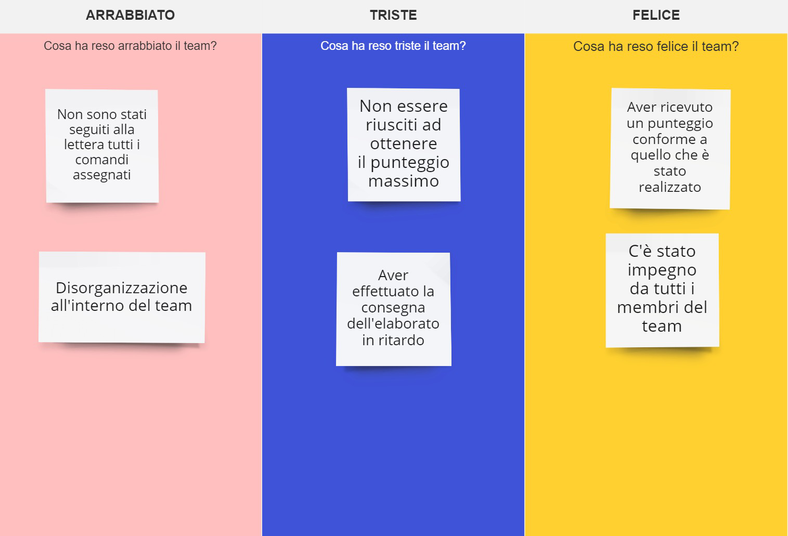